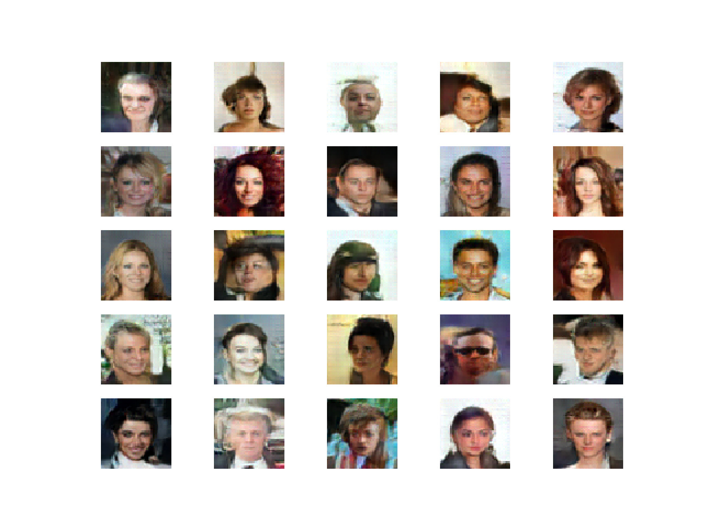
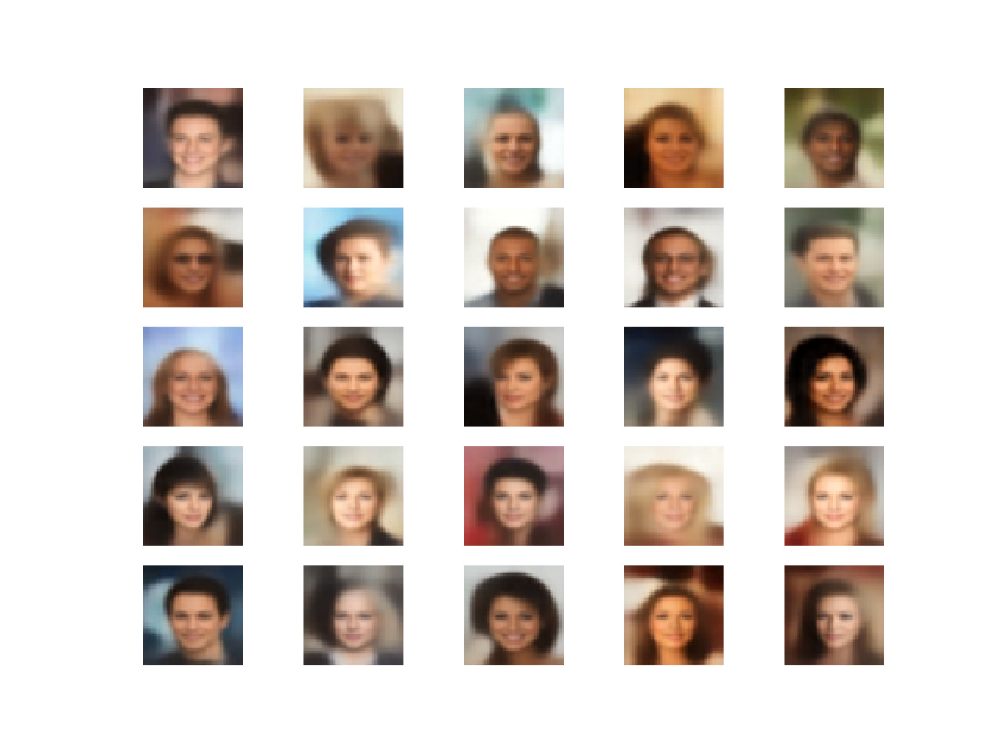

##### Disclaimer
This project is by David Bachmann (bacdavid). It is not published or affilated.

# RobuGAN

Combining a Variational Auto-Encoder with a modified Adversarial Loss to make GAN training more stable. The main idea is that the generated image is closely related to a sample, it is marely a slight perturbation of it. Exploiting this fact the feature maps of the critic can be matched along the regular adversarial loss, allowing for far more stable training. 
<figure>
	
	<figcaption>RobuGAN</figcaption>
</figure>

<figure>
	
	<figcaption>Vanilla-VAE</figcaption>
</figure>

.center {
  display: block;
  margin-left: auto;
  margin-right: auto;
  width: 50%;
}

## Details

### Generator

- Typical VAE network for the generator: Encoder - Sampler - Decoder
- Mainly convolutional layers for the encoder and de-convolutional layers for the decoder with kernel size 5x5 and strides of 2x2
- Batch Norm followed by ReLU after the (de-)convolution
- 64 - 128 - 256, 256 - 128 - 64 - 3 (RGB) feature maps for encoder and decoder, respectively

### Critic

- Similar to the encoder; use LeakyReLU instead of regular
- 64 - 128 - 256 feature maps

### Generator Loss

The generator loss is a modified adversarial loss function. It contains 3 terms:
- Reconstruction loss: This guarantees feature consistency between the generator and the samples
- Generator loss: This is the adversarial loss term, minimizing the distance between the critic's real and fake classification
- Regularizer: Regularize the Sampler to match a normal distribution

### Critic Loss

Train the critic to identify fake images ('0') and real images ('1')


## Try it

Simply open the file 
```
train.py
```
and perform the required adjustments.
